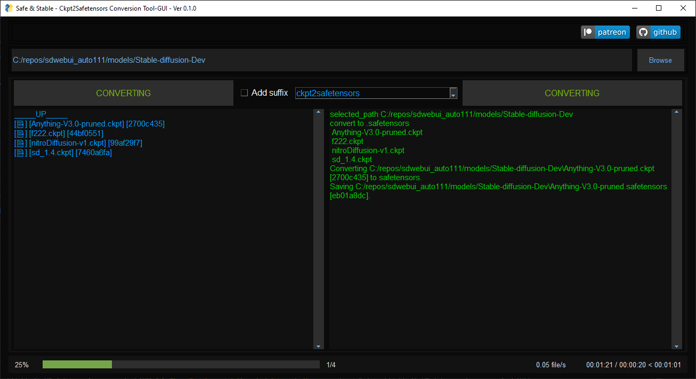
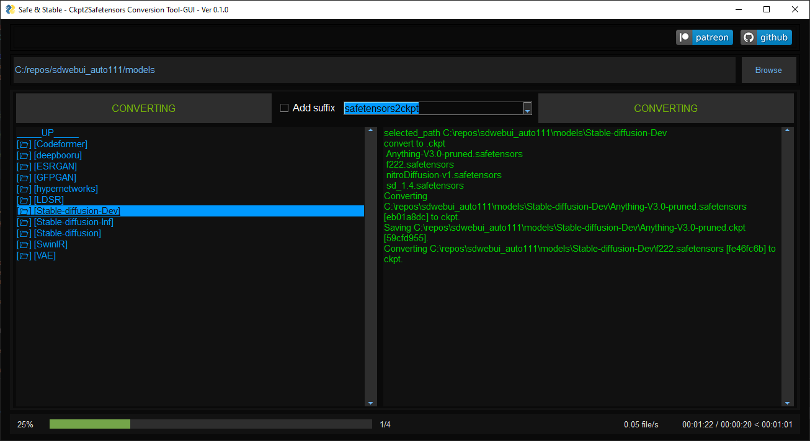
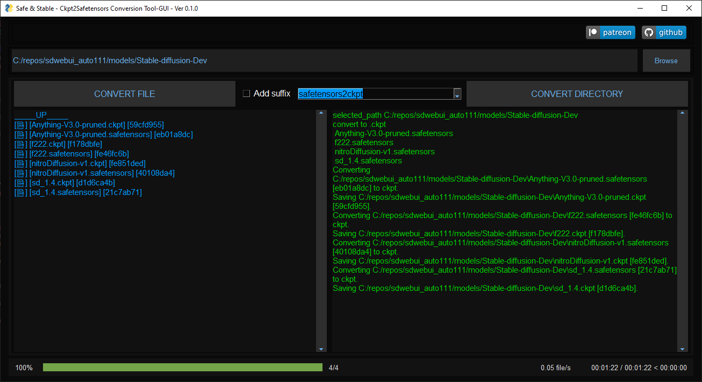

<!-- Improved compatibility of back to top link: See: https://github.com/othneildrew/Best-README-Template/pull/73 -->

<!--
*** Thanks for checking out the Best-README-Template. If you have a suggestion
*** that would make this better, please fork the repo and create a pull request
*** or simply open an issue with the tag "enhancement".
*** Don't forget to give the project a star!
*** Thanks again! Now go create something AMAZING! :D
-->
<!--
*** I'm using markdown "reference style" links for readability.
*** Reference links are enclosed in brackets [ ] instead of parentheses ( ).
*** See the bottom of this document for the declaration of the reference variables
*** for contributors-url, forks-url, etc. This is an optional, concise syntax you may use.
*** https://www.markdownguide.org/basic-syntax/#reference-style-links
-->
 

  
To continue to develop i will be happy to get some support.

<!--

-->
  <h1 align="center">Safe & Stable - Ckpt2Safetensors Conversion Tool-GUI</h1>
  <h3 align="center">    Convert your Stable Diffusion checkpoints quickly and easily.</h3>
  

This tool conversion process still requires the .ckpt data to be loaded first, which means that it may potentially load pickles. It is recommended to use this tool only with safe models or convert the models online to avoid any potential security issues.
     
     
    <a href="https://github.com/diStyApps/Safe-and-Stable-Ckpt2Safetensors-Conversion-Tool-GUI/issues">Report Bug</a>
    ·
    <a href="https://github.com/diStyApps/Safe-and-Stable-Ckpt2Safetensors-Conversion-Tool-GUI/issues">Request Feature</a>
  

<!-- TABLE OF CONTENTS -->

  
Table of Contents

  <ol>
    <li>
      <a href="#about-the-project">About The Project</a>
    </li>
    <li><a href="#license">License</a></li>
    <li><a href="#roadmap">Roadmap</a></li>
    <li><a href="#contact">Contact</a></li>
    <li><a href="#my-other-projects">My Other Projects</a></li>    
    <li><a href="#acknowledgments">Acknowledgments</a></li>
  </ol>

<!-- Update -->
# Update
### Version 0.1.1
I am happy to share the release of version 0.1.1 of Safe-and-Stable-Ckpt2Safetensors-Conversion-Tool-GUI

This version includes the following new features and improvements:
 * Support for converting back to ckpt. now you can convert safetensors to ckpt and vice versa.
 * A file explorer for easier conversion.
 * The option to add a suffix to the output file, allowing users to keep the original file.
 * A hash check for files, displaying the first 8 characters of the hash.

Please note that converting a ckpt file to a safetensors file will change the hash of the file due the structure change of the file.

However, when converting back and forth between ckpt and safetensors, the hash will remain consistent.

For example, an original ckpt file with the hash "ccf3615f" will be converted to a safetensors file with the hash "0248da5c", and back to a ckpt file with the hash "68ed20ac". Both hashes will remain consistent between the two file formats.

Please consider donating to the project if you find it useful,so that I can maintain and improve this tool and other projects.

I hope you find these new features and improvements useful. As always, i welcome your feedback and suggestions.

Thank you for using my project.

(<a href="#readme-top">back to top</a>)

<!-- ABOUT THE PROJECT -->
## About The Project

Safe & Stable is a tool for converting stable diffusion .ckpt files to the new and secure .safetensors format for storing tensors as pure data.

This format provides improved security compared to the pickle format, as it prevents the inclusion of arbitrary and potentially malicious Python code.
It also has the potential to improve the performance of model loading on CPU and GPU.

Converting to .safetensors is recommended for stable diffusion users who want to improve the security and performance of their model storage and loading processes. It is especially useful for when distributing new models and merges.

The tool's graphical user interface (GUI) makes it easy for users to select the input files, view the progress of the conversion saving process.

Note that the conversion process still requires the .ckpt data to be loaded first, which means potentially loading pickles. It is recommended to scan for pickles before converting a model or convert online if no .safetensors version is provided. Once models start being distributed only in .safetensors format, this will no longer be necessary.

It is important to always check if the model works correctly before deleting the original .ckpt file.

(<a href="#readme-top">back to top</a>)

<!-- Downloads -->
## Downloads

Archived version (Windows) [7z](https://github.com/diStyApps/Safe-and-Stable-Ckpt2Safetensors-Conversion-Tool-GUI/releases/download/0.1.1/Safe-and-Stable-Ckpt2Safetensors-GUI.v0.1.1.7z)

Archived version (Windows) [Zip](https://github.com/diStyApps/Safe-and-Stable-Ckpt2Safetensors-Conversion-Tool-GUI/releases/download/0.1.1/Safe-and-Stable-Ckpt2Safetensors-GUI.v0.1.1.zip)

[Releases](https://github.com/diStyApps/Safe-and-Stable-Ckpt2Safetensors-Conversion-Tool-GUI/releases)

## Linux Installation (tested on python 3.8.10)

* git clone this repo
* cd into the repo
* python3.8 -m venv venv
* ./venv/bin/activate
* pip install -r requirements.txt
* python run_app_gui.py

(<a href="#readme-top">back to top</a>)

<!-- LICENSE -->
## License

Distributed under the MIT License. See `LICENSE.txt` for more information.

(<a href="#readme-top">back to top</a>)

<!-- ROADMAP -->
## Roadmap

The roadmap for the Safe & Stable conversion tool will be determined by the level of support.
and interest it receives.

If the tool proves to be useful, i have plans to continue improving its features and functionality, and to add support for new model formats and versions.

Thank you for any support.

See the [open issues](https://github.com/diStyApps/Safe-and-Stable-Ckpt2Safetensors-Conversion-Tool-GUI/issues) for a full list of proposed features (and known issues).

(<a href="#readme-top">back to top</a>)

<!-- CONTACT -->
## Contact

[@The_diSty](https://twitter.com/The_diSty) - distty@gmail.com

Project Link: [https://github.com/diStyApps/Safe-and-Stable-Ckpt2Safetensors-Conversion-Tool-GUI](https://github.com/diStyApps/Safe-and-Stable-Ckpt2Safetensors-Conversion-Tool-GUI)

(<a href="#readme-top">back to top</a>)

<!-- MY OTHER PROJECTS -->
## My Other Projects

Project Link: [https://github.com/diStyApps/Stable-Diffusion-Pickle-Scanner-GUI](https://github.com/diStyApps/Stable-Diffusion-Pickle-Scanner-GUI)

(<a href="#readme-top">back to top</a>)

<!-- ACKNOWLEDGMENTS -->
## Acknowledgments

* [https://github.com/huggingface/safetensors](https://github.com/huggingface/safetensors)
* [https://rentry.org/safetensorsguide](https://rentry.org/safetensorsguide)
* [https://github.com/AUTOMATIC1111/stable-diffusion-webui/pull/4930](https://github.com/AUTOMATIC1111/stable-diffusion-webui/pull/4930)
* [https://www.reddit.com/r/StableDiffusion/comments/z8mnak/switching_models_too_slow_in_automatic1111_use](https://www.reddit.com/r/StableDiffusion/comments/z8mnak/switching_models_too_slow_in_automatic1111_use)
* [stable-diffusion-webui](https://github.com/AUTOMATIC1111/stable-diffusion-webui)
* [huggingface](https://huggingface.co)

<!-- * [GitHub Emoji Cheat Sheet](https://www.webpagefx.com/tools/emoji-cheat-sheet)
* [Malven's Flexbox Cheatsheet](https://flexbox.malven.co/)
* [Malven's Grid Cheatsheet](https://grid.malven.co/)
* [Img Shields](https://shields.io)
* [GitHub Pages](https://pages.github.com)
* [Font Awesome](https://fontawesome.com)
* [React Icons](https://react-icons.github.io/react-icons/search)-->

(<a href="#readme-top">back to top</a>)

<!-- MARKDOWN LINKS & IMAGES -->
<!-- https://www.markdownguide.org/basic-syntax/#reference-style-links -->
[contributors-shield]: https://img.shields.io/github/contributors/othneildrew/Best-README-Template.svg?style=for-the-badge
[contributors-url]: https://github.com/othneildrew/Best-README-Template/graphs/contributors
[forks-shield]: https://img.shields.io/github/forks/othneildrew/Best-README-Template.svg?style=for-the-badge
[forks-url]: https://github.com/othneildrew/Best-README-Template/network/members
[stars-shield]: https://img.shields.io/github/stars/othneildrew/Best-README-Template.svg?style=for-the-badge
[stars-url]: https://github.com/othneildrew/Best-README-Template/stargazers
[issues-shield]: https://img.shields.io/github/issues/othneildrew/Best-README-Template.svg?style=for-the-badge
[issues-url]: https://github.com/othneildrew/Best-README-Template/issues
[license-shield]: https://img.shields.io/github/license/othneildrew/Best-README-Template.svg?style=for-the-badge
[license-url]: https://github.com/othneildrew/Best-README-Template/blob/master/LICENSE.txt
[linkedin-shield]: https://img.shields.io/badge/-LinkedIn-black.svg?style=for-the-badge&logo=linkedin&colorB=555
[linkedin-url]: https://linkedin.com/in/othneildrew
[product-screenshot]: images/screenshot.png
[Next.js]: https://img.shields.io/badge/next.js-000000?style=for-the-badge&logo=nextdotjs&logoColor=white
[Next-url]: https://nextjs.org/
[React.js]: https://img.shields.io/badge/React-20232A?style=for-the-badge&logo=react&logoColor=61DAFB
[React-url]: https://reactjs.org/
[Vue.js]: https://img.shields.io/badge/Vue.js-35495E?style=for-the-badge&logo=vuedotjs&logoColor=4FC08D
[Vue-url]: https://vuejs.org/
[Angular.io]: https://img.shields.io/badge/Angular-DD0031?style=for-the-badge&logo=angular&logoColor=white
[Angular-url]: https://angular.io/
[Svelte.dev]: https://img.shields.io/badge/Svelte-4A4A55?style=for-the-badge&logo=svelte&logoColor=FF3E00
[Svelte-url]: https://svelte.dev/
[Laravel.com]: https://img.shields.io/badge/Laravel-FF2D20?style=for-the-badge&logo=laravel&logoColor=white
[Laravel-url]: https://laravel.com
[Bootstrap.com]: https://img.shields.io/badge/Bootstrap-563D7C?style=for-the-badge&logo=bootstrap&logoColor=white
[Bootstrap-url]: https://getbootstrap.com
[JQuery.com]: https://img.shields.io/badge/jQuery-0769AD?style=for-the-badge&logo=jquery&logoColor=white
[JQuery-url]: https://jquery.com 

